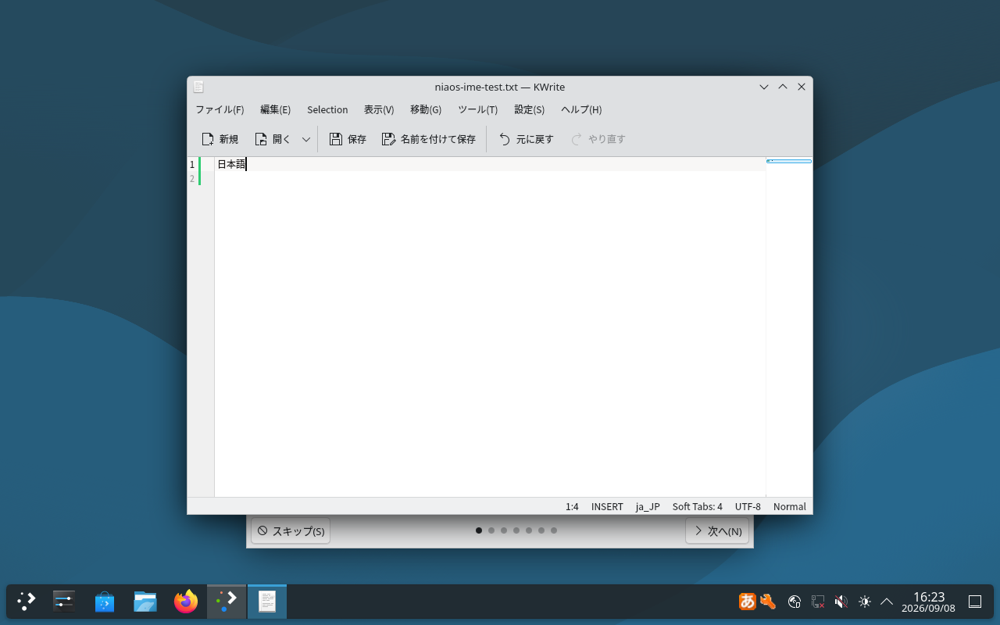

# Debian 13 KDE開発イメージの受入

2026-09-08。`niaos-0.1.0-amd64.hybrid.iso`、3,640,655,872 bytes。
SHA-256: `11333d615170da99ebba932f81b2cd24b18f9190231210282efc8f0dc43daf16`。
ISO全体をホストへコピー後、同じSHA-256を再確認した。

## 実行した受入

[一括実行report](acceptance/report.json)の6項目が成功した。実行時間792.213秒。メモリ3 GiB・swapなし・CPU 1コア分・128プロセスの外側kernel制限を確認し、QEMUゲストはメモリ2 GiB・1 vCPUで必ず順番に実行した。

| 対象 | 結果 |
| --- | --- |
| BIOS Live | KDE Waylandで起動。Mozcと実キーボードイベントで「日本語」を入力し、保存内容を照合 |
| UEFI Live | 起動と、通常HTTPSミラーの署名付きAPT索引取得 |
| Secure Boot Live | OVMFのMicrosoft鍵入り変数と署名済みDebian shim/GRUB/kernelで起動。実際のEFIフラグを確認 |
| UEFIオフライン導入 | 新規仮想ディスクへ導入し、ディスクから再起動。利用者選択に沿ったCDソースのみのAPT設定 |
| BIOSオンライン導入 | 通常Debianミラーを選んで導入・再起動し、署名付きAPT索引取得 |
| 導入済みディスクのSecure Boot | UEFI導入ディスクをMicrosoft鍵入りOVMFで起動 |

6回の起動後検査では、NiaOS識別情報、dpkg整合性、独自パッケージ、NetworkManager、デスクトップ、host observer、APT設定を確認した。検査時点の失敗systemdユニットはいずれも0件。各試験は実際の電源断まで待った。

## パッケージと構築

独自パッケージは、[先行する独立した再ビルド](../accepted-05/README.ja.md)で58個の登録Adaテストmainを実行済みの、同じ成果物を使った。今回の構築記録と以下の比較結果の35ファイルのhashを再照合した。[19 DEBの比較](distro-deb-comparison-04.json)は全件一致し、デバッグパッケージも含む。[8組のnative source package](distro-native-source-comparison-04.json)の`.dsc`・source tarも16ファイルすべて一致した。識別DEBの導入・再導入・remove・purgeによるDebian識別情報の復元も成功した。別の試作時には同じ版のbase-files再導入も確認しているが、将来のbase-files版への更新試験とは扱わない。

[実際の構築入力](build-record/input-manifest.json)、[生成物と構成のhash](build-record/report.json)、ビルダーのパッケージ版とログを保存した。`auto/config`、独自DEBのhookと既定設定だけで統合し、既存7コンポーネント・Debianの上流ソースにはパッチを加えていない。bootstrapのCA証明書、HTTPSの親インストーラーミラー、公式`apt-mirror-setup` udebの追加入力を含む。

`acceptance-tools/`は実行前に固定した工具のコピー。Git側の変更が途中で混ざらないよう、このコピーをread-onlyでmountした。ビルダーimage IDは`7f92f64938b87b862dd962a93b558fb0caea13493745c684fbddfc190a723617`。

## 範囲と残る確認

これはamd64・KDEのVM受入であり、実機のGPU・音声・無線・サスペンド、対話GUIインストーラーの全操作、暗号化導入、GNOME/serverイメージの受入ではない。試験用preseed・公開試験パスワード・シリアルconsole設定・EFI removable path設定は専用VMだけに適用した。

Live終了時のログには読み取り専用`/run/live/medium`のunmount警告が残る。メディア取り出し確認を経た電源断を観測しており、警告を削除したログにはしていない。導入済みシステムの終了では通常のunmount完了も記録している。

7コンポーネントの配置とhost observer確認は、未接続のCapsule/native broker等の製品機能の完成を意味しない。05/06の[再構築比較で見つかったAPTキャッシュの差](../reproducibility-05-06/README.ja.md)に対し、標準のrootfs除外設定を加えた。[実SquashFSの確認](cache-exclusion-check-07.json)で2ファイルの不在と、2,239件のpackage一覧の一致を確認した。07/08の[ISO全体の比較は不一致](../reproducibility-07-08/README.ja.md)で、完成SquashFS内のAppStreamキャッシュ1ファイルの差を確認した。後続候補でその除外と再構築比較を行う。対応ソース収集は別工程として未完。公開先と署名運用は、このVM受入とは別の確認が必要。本番認定・GitHubへの公開は行っていない。

ISO・DEB・udeb・initrd・仮想ディスク・OVMF変数ファイルはGitへ入れない。`build-record/report.json`の全ステージ一覧は外部の完全な構築記録を指す。このディレクトリはペイロードを除いた小さな証跡セットであり、ISOの配布物一式ではない。ログのgzip mtimeは0に固定した。
