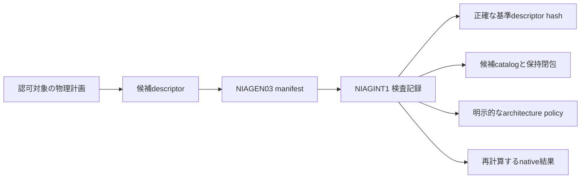

# 公開計画へ束縛するnative検査記録

`NIAGEN03`は、公開時に必要なnative検査記録のCAS hashをmanifestへ追加する。
`Pkg_Generation_Intent`は元DEBから初期構築の最終集合、又は通常更新の差分を検査し、
`NIAGINT1`へ保存する。記録の存在だけを実行許可にはしない。

## 認可と状態の接続

既存のManaged guardが認可する物理計画のhashへ、検査記録を間接的に束縛する。
別のpolicyや検査記録を渡すにはmanifest・descriptor・物理計画も変わる。
認可を省略するcallbackや、公開時だけの未束縛のpolicy引数は追加しない。
本番の認可主体はpolicyの出所、供給、全phase/効果を引き続き独立して検査する必要がある。

Publisherはpublication/root/CAS予約下で実root.stateと計画の正確な前後descriptorを照合する。
基準manifestの保持閉包と候補の保持閉包を確認し、検査記録のpolicyを使って
元DEBからnative最終集合・通常更新を再計算する。記録した結果とBindingが一致しなければ公開しない。
成功した検査だけで既存Managed guardを省略することはできない。

初期構築は空の基準descriptorと、実際の初期root.stateを必要とする。
候補最終集合の依存関係・共存・architectureを検査し、通常更新を初期構築と偽って
Essential/Protected維持の検査を回避することはできない。
通常更新と初期構築の記録はどちらも、供給認証・保護移行・rollback floorの許可そのものではない。

CAS予約は既存の実行器への移行時に解放し、実行器が取り直した実状態も照合する。
候補stageの予約とpublication予約は維持する。CAS lockが公開の全区間で連続すると主張しない。
外部read APIを保持中の同じlockへ再入させる実装は使わない。

## 保持と版

NIAGEN01/02は従来どおり160 byteのheaderを使い、予約byteとtransaction導出を変更しない。
NIAGEN03は192 byteのheaderを使い、0起点offset160の32 byteへIntent hashを保存する。
batch recordはそのheaderの直後に置く。版番号を書き換えた降格や余分な末尾byteは拒否する。

既存の世代transaction pin → manifest → 検査記録、という参照を使い、第二のDBや重複pinを作らない。
検査記録が欠けていればstage/native読取/公開を拒否し、再作成によって欠落を隠さない。
GCには検査記録の正確な基準descriptorとcatalog参照を辿る規則も必要である。GC自体の実装ではない。

新しいPublishはNIAGEN03を必須とする。NIAGEN02のnative読取とNIAGEN01の構造読取は維持する。
旧版の公開計画の再実行も新しいPublishでは拒否するため、旧版で途中のtransactionがある場合は
保持した旧実装で復旧を終えてから移行する必要がある。本番の旧版移行・実起動受入は未完である。

## NIAGINT1の正規形式

整数はbig endian、文字列は長さに一致するbyte列である。

| 0起点offset | bytes | 内容 |
| --- | --- | --- |
| 0 | 8 | ASCII `NIAGINT1` |
| 8 | 16 | root identity |
| 24 | 32 | 基準descriptor hash。初期構築だけzero |
| 56 | 32 | 候補catalog hash |
| 88 | 32 | 候補保持閉包 hash |
| 120 | 32 | 初期構築は最終集合fingerprint、通常更新はtransition fingerprint |
| 152 | 32 | Binding |
| 184 | 4 | native architecture文字列のbyte長 |
| 188 | 4 | enabled architecture件数 |
| 192 | 可変 | native文字列、その後にenabled各項のu32長と文字列 |

Enabledは重複のない昇順で保存する。順序だけ異なる同一policyは同じCAS objectになる。
既存の256 architecture・各4096 byte上限を維持し、末尾の余剰・切断・不正件数を拒否する。
`Check_Target`は正規形式と候補参照の検査だけであり、native意味の検査済みとはしない。

通常更新のBindingは既存の`NIAUPD01`と同一である。
初期構築のBindingはASCII `NIAINI01` + root identity 16 byte + 候補catalog 32 byte +
候補保持閉包32 byte + 最終集合fingerprint 32 byte、全120 byteのSHA-256である。
最終集合fingerprintには明示的なarchitecture policyが含まれる。

## 検査範囲

二世代の公開・復旧と独立readerで、元DEBから両記録のnative結果とBindingを照合する。
記録自身を含む保持欠落、旧版公開拒否、不正な形式/policy/結果、異なるroot、偽の初期構築を検査する。
構造上は候補へ結び付いた不正な記録でも、組立て済みstageの公開が止まり、root.stateと
generation.nextが変わらないことを検査する。合成authorityとtree/versionは実OS適用の認定ではない。
本番admission adapter、全DEB phase・所有権・効果・全世代属性、実root/boot、完全置換は未完である。
